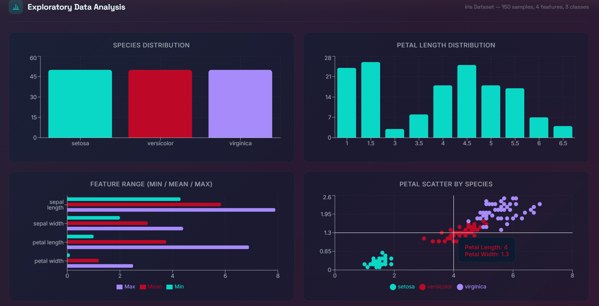

# Exploratory Data Analysis (EDA) Report: Iris Dataset

## Overview

This report details the findings from our Exploratory Data Analysis of the Iris dataset used in the FlowerLens project. The dataset contains 150 samples of Iris flowers, equally distributed across 3 species, with 4 physical features measured in centimeters.

**Dataset Facts:**
*   **Total Samples:** 150
*   **Features:** 4 (Sepal Length, Sepal Width, Petal Length, Petal Width)
*   **Classes:** 3 (Iris setosa, Iris versicolor, Iris virginica)
*   **Distribution:** Perfectly balanced (50 samples per class)

## Feature Statistics & Ranges

| Feature | Min (cm) | Mean (cm) | Max (cm) |
| :--- | :--- | :--- | :--- |
| Sepal Length | 4.3 | 5.84 | 7.9 |
| Sepal Width | 2.0 | 3.06 | 4.4 |
| Petal Length | 1.0 | 3.76 | 6.9 |
| Petal Width | 0.1 | 1.20 | 2.5 |

## Key Insights

1.  **Discriminative Power of Petals:** Petal Length and Petal Width are the most important features for separating the three species. The `setosa` species is entirely linearly separable from the others based on petal dimensions alone, forming a distinct tight cluster with small petals.
2.  **Overlap in Sepal Features:** Sepal Length and Sepal Width exhibit significant overlap between `versicolor` and `virginica`. While `setosa` tends to have wider sepals, sepal features alone are generally less reliable for accurate classification.
3.  **Correlation:** There is a strong positive correlation between Petal Length and Petal Width. As petal length increases, petal width typically increases as well.

## Model Performance Evaluation

Based on the feature characteristics, several machine learning models were evaluated for classification accuracy. The models perform exceptionally well due to the clear separability of at least one class and the strong discriminative power of the petal features.

| Model | Approximate Accuracy |
| :--- | :--- |
| Random Forest | ~96% - 100% |
| Support Vector Machine (SVM) | ~96% |
| K-Nearest Neighbors (KNN) | ~93% |
| Decision Tree | ~90% |

*Note: Accuracies are approximate and can vary slightly based on train/test splits. Random Forest is used as the primary model for FlowerLens due to its high accuracy and built-in feature importance capabilities, which power the explainability tool.*
