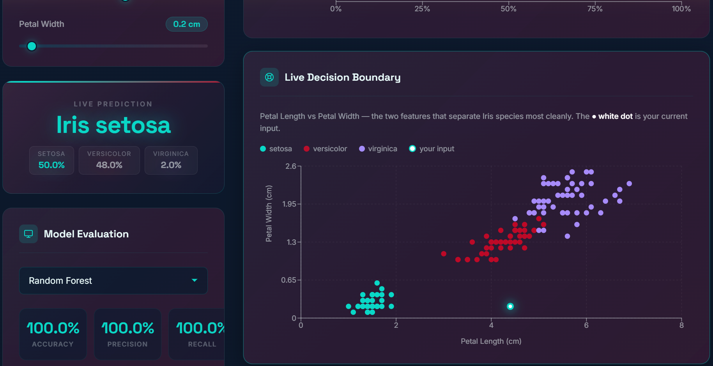
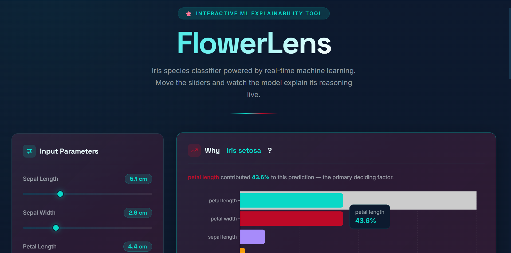

<div align="center">
  <h1>🌸 FlowerLens</h1>
  <p>Interactive ML species classifier + explainability tool</p>
</div>



## Overview

FlowerLens is an interactive Machine Learning tool designed for classifying Iris plant species from physical measurements. It provides a live ML classifier with interactive sliders for measurements and a visual explanation of which features drove the prediction. It helps researchers understand **why** a model made a classification, not just what it predicted.



## Features

*   **Live Classifier:** Adjust petal and sepal measurements using interactive sliders and see real-time predictions.
*   **Model Explainability (XAI):** Visualizes feature importance, explaining which measurement was the deciding factor.
*   **Exploratory Data Analysis (EDA):** Built-in dashboards showing species distribution, feature ranges, and scatter plots.
*   **Live Decision Boundary:** A scatter plot map showing where the current user input sits on the feature distribution.
*   **Model Comparison:** Compare predictions across different ML models (Random Forest, SVM, KNN, Decision Tree) and view their accuracy, precision, and recall.

## Tech Stack

*   **Frontend:** React 18, Vite, Recharts, Axios, Lucide React, Vanilla CSS
*   **Backend:** FastAPI, Uvicorn, Scikit-learn, Pandas, NumPy, Pydantic
*   **Machine Learning:** Iris Dataset, Random Forest feature importances for XAI
*   **Styling:** Premium Dark Theme, Glassmorphism, Space Grotesk + Inter (Google Fonts)

## API Endpoints

| Method | Endpoint | Description |
| :--- | :--- | :--- |
| `GET` | `/api/eda` | Returns data for EDA visualizations (distributions, ranges). |
| `POST` | `/api/predict` | Accepts measurements and returns prediction & feature importances. |
| `GET` | `/api/models` | Returns a list of available ML models and their performance metrics. |
| `GET` | `/api/scatter-data` | Returns data points for the Decision Boundary scatter plot. |

## Setup & Installation

### Prerequisites
*   Node.js (v16+)
*   Python (3.8+)

### Backend Setup

1.  Navigate to the project directory:
    ```bash
    cd FlowerLens
    ```
2.  Create and activate a virtual environment (optional but recommended):
    ```bash
    python -m venv backend/venv
    # Windows
    backend\venv\Scripts\activate
    # macOS/Linux
    source backend/venv/bin/activate
    ```
3.  Install dependencies:
    ```bash
    pip install -r backend/requirements.txt
    ```
4.  Run the backend server:
    ```bash
    backend\venv\Scripts\python backend\main.py
    # OR using uvicorn directly:
    # backend\venv\Scripts\uvicorn backend.main:app --reload
    ```
    The backend will run at `http://127.0.0.1:8000`.

### Frontend Setup

1.  Open a new terminal and navigate to the frontend directory:
    ```bash
    cd FlowerLens/frontend
    ```
2.  Install dependencies:
    ```bash
    npm install
    ```
3.  Run the development server:
    ```bash
    npm run dev
    ```
    The frontend will be available at `http://localhost:5173`.
